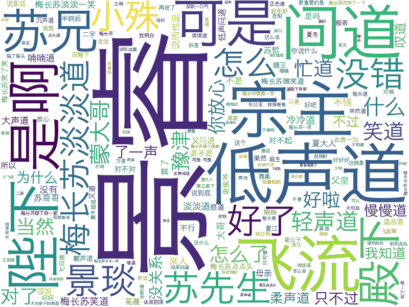
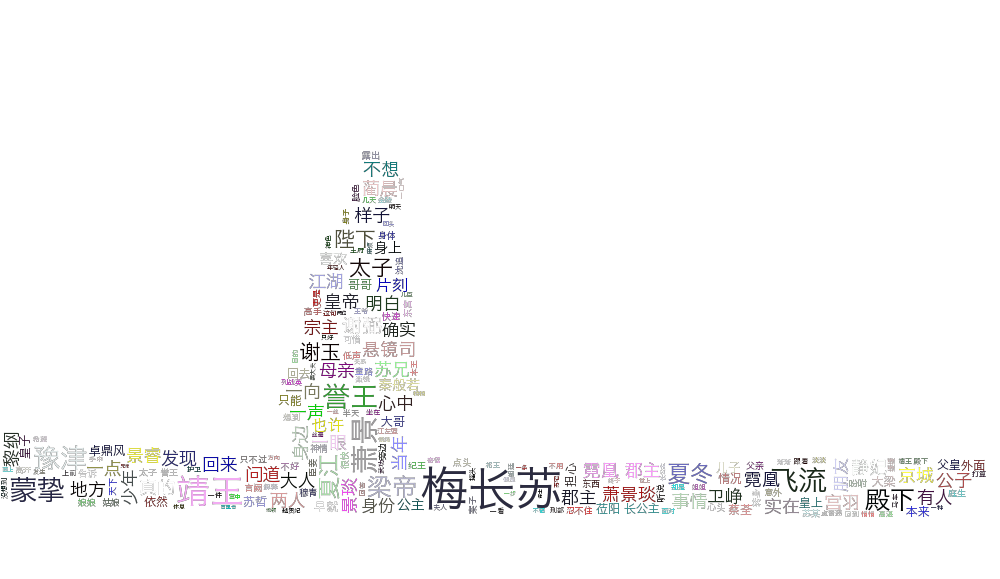
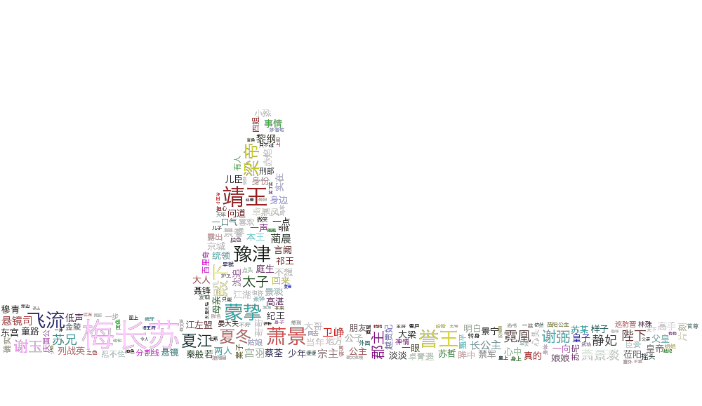

# 词云

## 结果

### 最基本的词云

### 分词、去停用词 

### 分词、保留指定词 

### 分词、去停用词、使用蒙版、从图片中生成颜色

### 分词、去停用词、使用蒙版、颜色随机

### 分词、去停用词、提取关键词、使用蒙版、颜色随机 

### 分词、保留指定词、颜色随机

## WordCloud

WordCloud() 可选的参数：
- font_path：可⽤于指定字体路径，包括 otf 和 ttf
- width：词云的宽度，默认为 400
- height：词云的⾼度，默认为 200
- mask：蒙版，可⽤于定制词云的形状
- min_font_size: 最小字号，默认为 4
- max_font_size: 最大字号，默认为词云的高度
- max_words：词的最⼤数量，默认为 200
- stopwords：将被忽略的停⽤词，若不指定则使⽤默认停⽤词词库
- background_color：背景颜⾊，默认为 black
- mode：默认为RGB模式，如果为RGBA模式且background_color设 为 None，则背景将透明

## 参考

- 《深度有趣：高端又一般的词云》 —— 张宏伦
